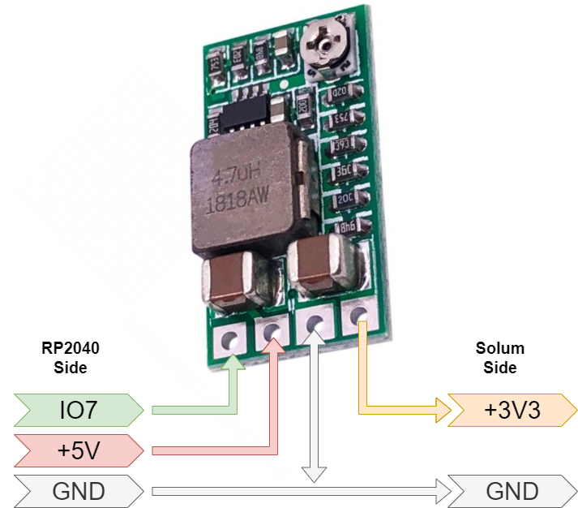

# RP2040 Based Solum flasher
this is a quick port of the ZBS_Flasher from ATC1441 to the RP2040. With this you can easily flash the ZBS based ESL tags with new firmware.

# Connections

# Pins
Solum Debug Pin                       |Name                       |RP2040 Pin
:-------------------------:|:-------------------------:|:-------------------------:
1 | VCC (3.3V) | 7 (note 1)
2 | SPI MOSI | 11 
3 | SPI CS | 13 
4 | UART TXD | 8 
5 | SPI SCLK | 10 
6 | SPI MISO | 12 
7 | GND | GND 
8 | Reset | 15 
9 | UART RXD | 9 
10 | Test P1.0 | 14 

**Note 1:** I used the enable pin of a voltage regulator connected to IO7 of the RP2040 to control power to the ESL. 

# usage

This is completely compatible with the tools from ATC1441, so please refer to his page
for the tools

[atc1441/ZBS_Flasher](https://github.com/atc1441/ZBS_Flasher)